# Procesverslag
**Auteur:** Delano

Markdown cheat cheet: [Hulp bij het schrijven van Markdown](https://github.com/adam-p/markdown-here/wiki/Markdown-Cheatsheet). Nb. de standaardstructuur en de spartaanse opmaak zijn helemaal prima. Het gaat om de inhoud van je procesverslag. Besteedt de tijd voor pracht en praal aan je website.

## Bronnenlijst
1. https://nba.2k.com/nl-NL/
2. https://courses.wesbos.com/
3. https://w3schools.com
4. https://flexboxfroggy.com/#nl

## Eindgesprek (week 7/8)

-dit ging goed & dit was lastig-

**Screenshot(s):**

-screenshot(s) van je eindresultaat-

## Voortgang 3 (week 6)

Deze week had ik mij vooral gericht op het responsive gedeelte op pagina 1, de footer kreeg ik nu wel responsive met behulp van de flex-wrap: wrap.
Waar ik nog steeds niet ben uitgekomen is hoe ik het rode blokje op de 2e pagina weg krijg, hierdoor ben ik niet toegekomen aan de keuzes van consoles toevoegen. 

Hieronder is het eindresultaat van deze week:

Feedbackgesprek Janno:

- Voeg een max-width aan, zodat al je content niet oneindig mee schaalt
- Maak de tekst, qua grootte, ook responsive het is dan duidelijker lezen op een groot beeldscherm
- De 2e pagina mag meer opgevuld worden met content
- Ik ben benieuwd naar je hamburger menu, wanneer hij werkt

## Voortgang 2 (week 5)
Deze week had ik mij gericht op mijn 1e pagina hoe ik mijn Kobe Bryant afbeelding achter de tekst kreeg. Ik kreeg een tip van Jelmer om de afbeelding binnenin mijn div te doen en nu werkt het. Ook vroeg ik aan jelmer om mij te kunnen helpen met de Youtube video, want ik had een paar forms bezocht met eventueel een oplossing maar daar kwam ik ook niet uit. Wat niet lukte was de footer responsive te maken, mijn tekst viel steeds buiten mijn container. Daarnaast werd de afbeelding van de hamburger menu steeds een rood blokje op de 2e pagina. Tot slot heb ik 2 pagina's gecodeert staan, maar nog niet alle content toegevoegd zoals de console keuzes.

Hieronder is het eindresultaat van deze week:

Pagina 1
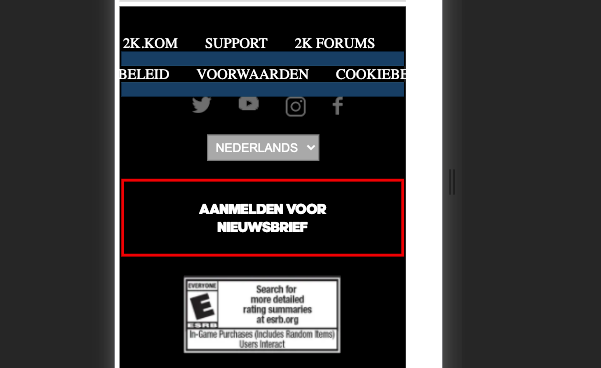
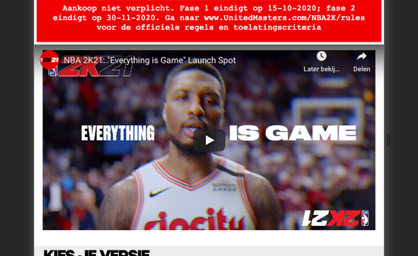

Pagina 2
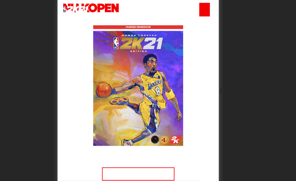

Feedbackgesprek Jelmer:

- Tip voor de footer is om flex-wrap: wrap te gebruiken om de tekst responsive te maken
- Voor het rode blokje heb je de header gekopieert naar je 2e pagina, maar de kopen button vervalt. Misschien is het beter om op je 2e pagina de header apart weer aan te spreken.

## Voortgang 1 (week 3)
Deze week ben ik aan mijn eerste pagina begonnen. Ik kreeg mijn Kobe Bryant afbeelding niet achter mijn tekst, de header moest nog responsive zijn en de youtube video werkte nog niet.

Hieronder is het eindresultaat van deze week:

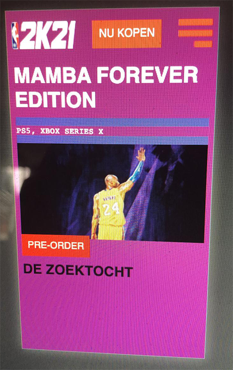
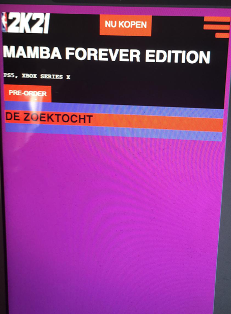

Feedbackgesprek Jelmer:

- Je kan de afbeelding binnenin de div doen als achtergrond
- De Youtube video is wel mogelijk zonder een foutmelding, er is een link die ik je kan sturen zodat het waarschijnlijk wel gaat werken

## Intake (week 1)

**Je startniveau:** blauwe piste

**Je focus:** responsive

**Je opdracht:** link naar de website die je gaat namaken óf de naam van je eigen ontwerp 
https://nba.2k.com/nl-NL/

**Screenshot(s):**
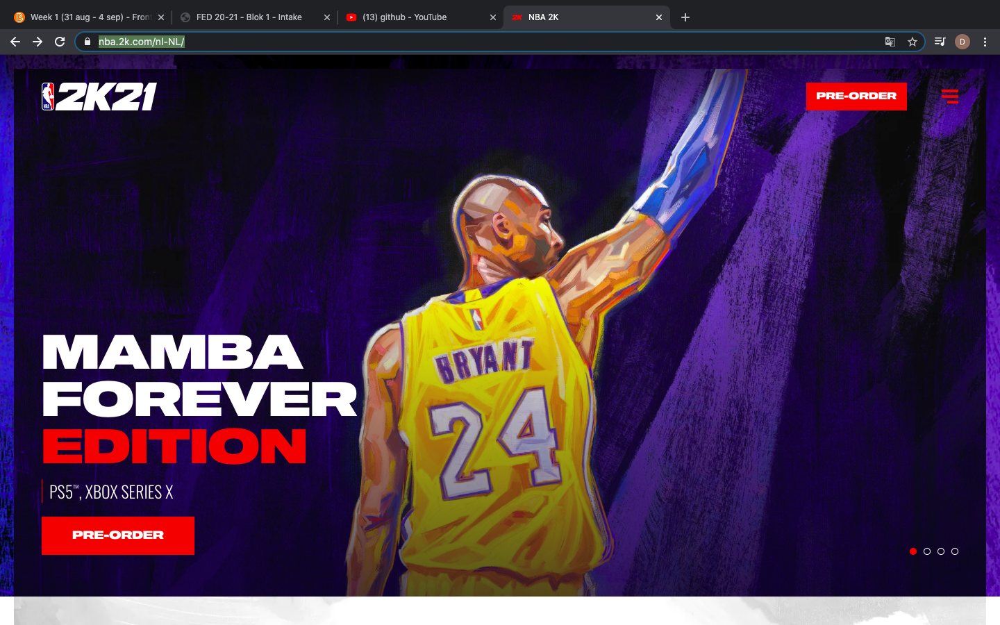
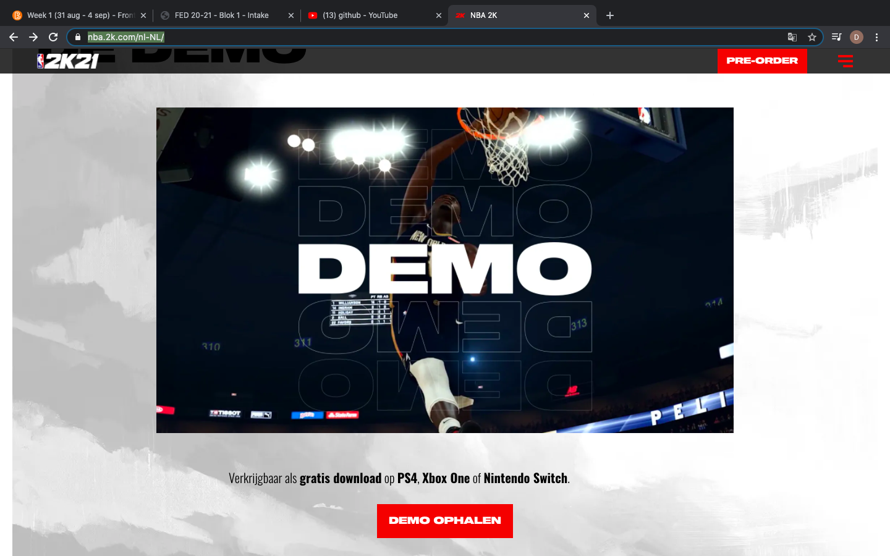
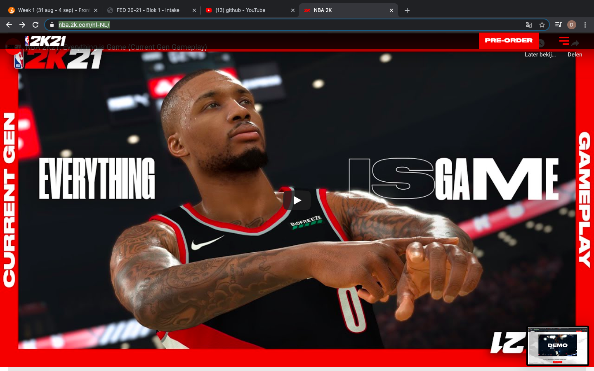
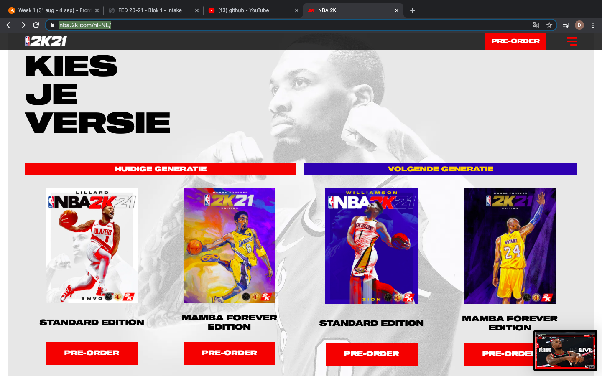
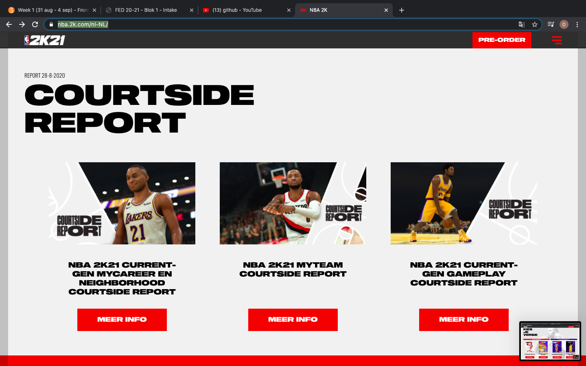

**Breakdown-schets(en):**

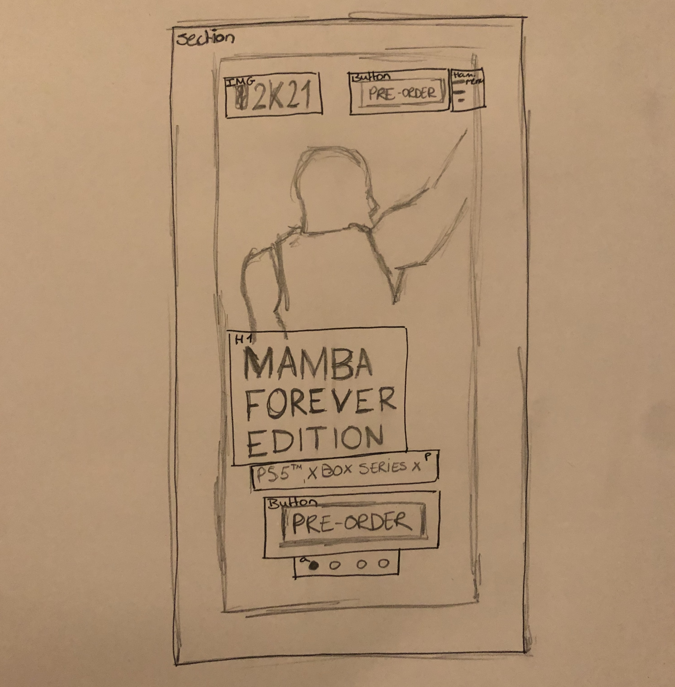 
