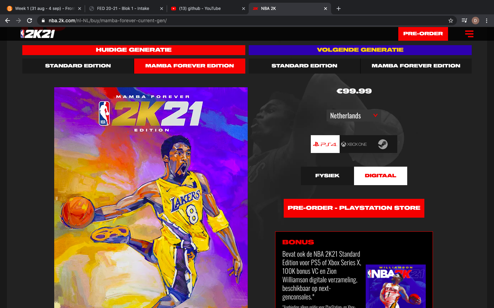

# Procesverslag
**Auteur:** Delano

Markdown cheat cheet: [Hulp bij het schrijven van Markdown](https://github.com/adam-p/markdown-here/wiki/Markdown-Cheatsheet). Nb. de standaardstructuur en de spartaanse opmaak zijn helemaal prima. Het gaat om de inhoud van je procesverslag. Besteedt de tijd voor pracht en praal aan je website.

## Bronnenlijst
1. https://nba.2k.com/nl-NL/
2. https://courses.wesbos.com/
3. https://w3schools.com
4. https://flexboxfroggy.com/#nl

## Eindgesprek (week 7/8)

-dit ging goed & dit was lastig-

**Screenshot(s):**

-screenshot(s) van je eindresultaat-

## Voortgang 3 (week 6)
-same as voortgang 1-

## Voortgang 2 (week 5)
2 pagina's kunnen laten zien, maar nog niet helemaal af. 

Wat lastig ging:

- De footer kreeg ik niet responsive.
- Hamburgermenu werd een rood blokje op de 2e pagina.
- De keuze tussen consoles moet nog toegevoegd worden.

## Voortgang 1 (week 3)
Aan mijn eerste pagina begonnen. 

Wat lastig ging:

- Ik kreeg mijn afbeelding van Kobe Bryant niet achter mijn tekst.
- De header moest nog responsive zijn.
- Youtube video werkt nog niet.

### Stand van zaken

-dit ging goed & dit was lastig-

**Screenshot(s):**

-screenshot(s) van hoe ver je bent-

### Agenda voor meeting

-samen met je groepje opstellen-

### Verslag van meeting

-na afloop snel uitkomsten vastleggen-

## Intake (week 1)

**Je startniveau:** blauwe piste

**Je focus:** responsive

**Je opdracht:** link naar de website die je gaat namaken óf de naam van je eigen ontwerp 
https://nba.2k.com/nl-NL/

**Screenshot(s):**

**Breakdown-schets(en):**

 
